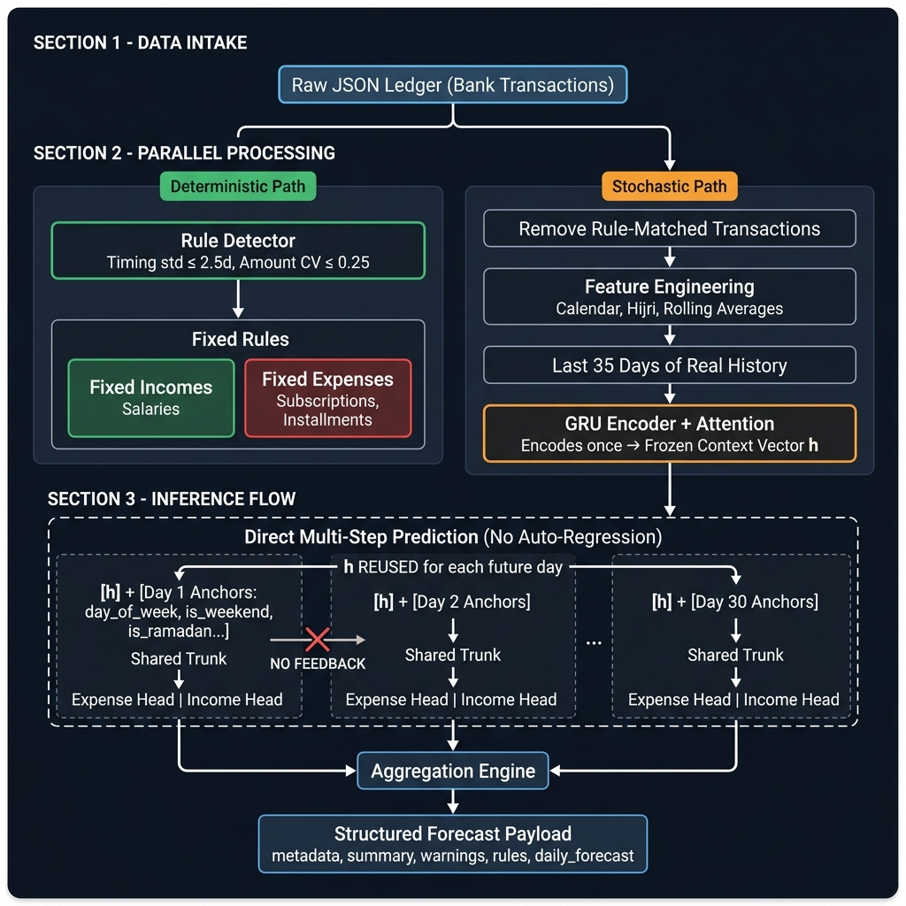

# Baseera: Theoretical Architecture & Design Patterns

This document explains the deep architectural choices made in the Baseera Personal Finance Forecasting system. It aims to answer *why* the system is designed this way, focusing on the theoretical underpinnings of the hybrid model.

---

## 1. The Core Architectural Philosophy: Why a Hybrid System?

Personal finance is inherently dual-natured. A typical ledger consists of:
1. **Deterministic Events:** Fixed salaries, bank installments, and flat-rate monthly subscriptions. These are highly predictable in both timing and amount.
2. **Stochastic Events:** Grocery runs, dining out, impulsive shopping, fluctuating transport costs, and irregular freelance income. These are highly variable and follow organic, noisy distributions.

If you attempt to model this entire dataset using a pure Deep Learning auto-regressive model (like a Transformer or pure LSTM), the model will often "smear" deterministic events. For example, instead of predicting exactly a 20,000 EGP salary on the 25th of the month, the model might predict 5,000 EGP across the 24th, 25th, 26th, and 27th. 

Conversely, pure rules-based systems cannot capture the subtle variations of stochastic spending (e.g., spending less on dining during the end of the month when cash is tight).

**The Solution:** Baseera employs a **Hybrid Architecture**. It uses a statistical heuristic engine to extract and explicitly model the deterministic events, and delegates only the remaining stochastic data to a dual-head Gated Recurrent Unit (GRU) neural network that independently predicts both expenses and irregular income.

---

## 2. System Architecture



The system splits the raw transaction ledger into two parallel processing paths:

- **Deterministic Path (Left):** The Rule Detector identifies fixed recurring patterns (salaries, subscriptions, installments) using statistical thresholds on timing consistency and amount variance.
- **Stochastic Path (Right):** After removing rule-matched transactions, the remaining chaotic data flows through feature engineering, windowing, and into the Dual-Head GRU which independently predicts daily expenses and irregular income.

Both paths merge at the **Aggregation Engine**, which produces the final structured forecast payload containing metadata, summary metrics, balance warnings, detected rules, and a day-by-day forecast array.

---

## 3. The Rule Detector: Heuristics & Mathematics

The Rule Detector acts as a sieve, filtering out the "noise" (predictable events) before the data reaches the neural network. 

### Why run on Uncapped Data?
Machine Learning pipelines often "cap" outliers (e.g., capping amounts above the 99th percentile) to prevent network instability. However, salaries and large installments *are* the outliers in a standard ledger. We run the Rule Detector on **uncapped data** so it doesn't artificially squash the very events it's trying to find.

### The Mathematics of Detection
For every unique (category, merchant) pair, the system groups the occurrences and evaluates:
1. **Timing Consistency:** We calculate the Standard Deviation (std) of the `day_of_month`.
   - `std <= 2.5 days`: We accept this as a fixed timing event. (Allows for weekend/holiday jitter).
2. **Amount Consistency:** We calculate the Coefficient of Variation (CV = std / mean).
   - `CV <= 0.25`: This allows a 25% variance. For example, an electricity bill fluctuates slightly every month, but it stays within a tight bounded range compared to groceries.
3. **Frequency Check:** The pattern must have appeared at least 3 times.
4. **Activation Check:** If the pattern hasn't been seen in the last 2 months, it is marked as inactive (e.g., a cancelled subscription).

Patterns that pass these checks are categorized as either **Fixed Income** or **Fixed Expense** (based on the sign of the median amount) and completely removed from the dataset destined for the GRU.

---

## 4. The Neural Network: Dual-Head GRU with Attention

Once the predictable data is removed, we are left with pure, chaotic daily cash flows. We model this using a dual-head GRU architecture.

### Why GRU over LSTM or Transformers?
- **Transformers** require massive amounts of data to learn temporal hierarchies. A single user's ledger (even 5 years of data) is only ~1,800 days. Transformers severely overfit on this scale.
- **LSTMs** have a complex 3-gate structure.
- **GRUs** (Gated Recurrent Units) have a simpler 2-gate structure (Reset and Update gates). They achieve identical performance to LSTMs on mid-length sequence tasks but require significantly fewer parameters, making them the optimal choice for preventing overfitting on highly sparse personal finance data.

### Why No Auto-Regression?
Traditional forecasting feeds the prediction of $T_1$ as the input for $T_2$. In personal finance, an error in $T_1$ will compound exponentially by $T_{30}$, resulting in "catastrophic drift". 
Instead, Baseera uses **Direct Multi-step Forecasting**. The GRU encodes the *actual* last 35 days of context exactly once, and independently predicts day 1, day 2... up to day 30 using robust calendar features (e.g., `days_to_month_end`, `is_weekend`) as anchors.

### Dual-Head Architecture
The model uses a shared encoder trunk with two separate output heads:
- **Expense Head (Softplus):** Predicts the stochastic daily expense amount. Uses Softplus activation to enforce non-negativity.
- **Income Head (Softplus):** Predicts irregular income (e.g., freelance payments). Separate gradient path prevents the sparse income signal from interfering with the more frequent expense signal.

The income head is trained with a higher loss weight (2x) because income events are sparser and the model needs a stronger gradient to avoid always predicting zero.

### Attention Mechanism
A soft attention layer weighs the most relevant days in the 35-day history window before compressing to a single context vector. This allows the model to focus on, for example, a recent spending spike rather than treating all 35 days equally.

### Feature Engineering Highlights
To help the GRU understand cyclical spending, we inject:
- **Calendar Mechanics:** `day_of_week`, `is_month_start`, `days_to_month_end`.
- **Cultural Mechanics (Hijri):** `is_ramadan`, `is_eid_al_fitr`, `is_eid_al_adha`. In Egyptian finance, spending patterns shift drastically based on the lunar Islamic calendar, not just the Gregorian calendar.
- **Rolling Statistics:** `rolling_expense_7d`, `rolling_expense_14d`, `rolling_expense_30d` — trailing window averages that give the model a sense of recent spending momentum.

### Custom Loss Function (CashflowLoss)
The model trains using a composite loss:
```
Loss = α * HuberLoss + (1-α) * MAE     (for each head)
Total = LossExpense + 2.0 * LossIncome
```
- **Huber Loss (δ=1.0):** Robust to rare spending spikes — behaves like MSE for small errors and MAE for large outliers.
- **MAE (Mean Absolute Error):** Keeps the model grounded to the median, preventing it from wildly over-predicting small, everyday purchases.
- **Income Weight (2.0):** Amplifies the income learning signal since income events are much sparser than expenses.

---

## 5. Output: Structured Forecast Payload

The system produces a comprehensive JSON payload designed for direct consumption by backend services:

| Field | Description |
|---|---|
| `metadata` | Forecast horizon, date range, model accuracy (MAE) |
| `summary` | Starting balance, projected ending balance, net cash flow, income/expense totals |
| `warnings` | Dates where projected balance drops below zero or to critically low levels |
| `rules.fixed_incomes` | Detected recurring income rules (name, day, value, confidence) |
| `rules.fixed_expenses` | Detected recurring expense rules (name, day, value, confidence) |
| `daily_forecast` | Per-day breakdown: dynamic/fixed income & expense, net cash flow, projected balance |

---

## 6. Summary

By intelligently routing data based on its mathematical properties—sending tight, predictable clusters to a rules engine and chaotic, sparse distributions to a regularized dual-head GRU—Baseera elegantly solves the complex problem of personal cash-flow forecasting. The dual-head architecture ensures that both expense and income predictions maintain independent, uncontaminated gradient paths, while the structured output payload provides everything a backend or frontend needs to render rich financial dashboards.
