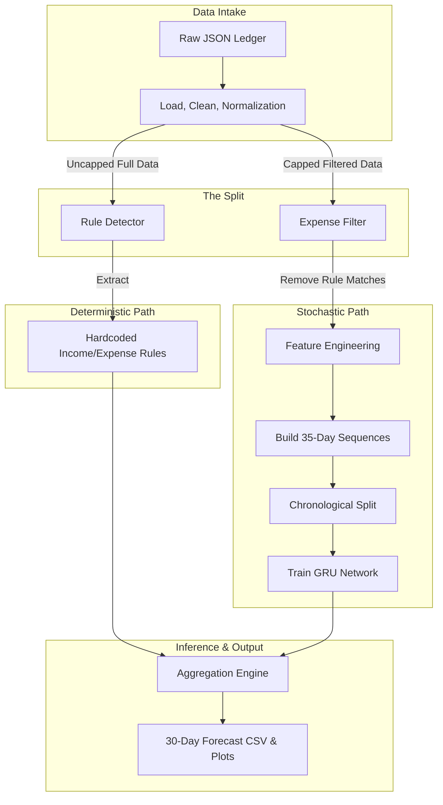

# Baseera: Theoretical Architecture & Design Patterns

This document explains the deep architectural choices made in the Baseera Personal Finance Forecasting system. It aims to answer *why* the system is designed this way, focusing on the theoretical underpinnings of the hybrid model.

---

## 1. The Core Architectural Philosophy: Why a Hybrid System?

Personal finance is inherently dual-natured. A typical ledger consists of:
1. **Deterministic Events:** Fixed salaries, bank installments, and flat-rate monthly subscriptions. These are highly predictable in both timing and amount.
2. **Stochastic Events:** Grocery runs, dining out, impulsive shopping, and fluctuating transport costs. These are highly variable and follow organic, noisy distributions.

If you attempt to model this entire dataset using a pure Deep Learning auto-regressive model (like a Transformer or pure LSTM), the model will often "smear" deterministic events. For example, instead of predicting exactly a 20,000 EGP salary on the 25th of the month, the model might predict 5,000 EGP across the 24th, 25th, 26th, and 27th. 

Conversely, pure rules-based systems cannot capture the subtle variations of stochastic spending (e.g., spending less on dining during the end of the month when cash is tight).

**The Solution:** Baseera employs a **Hybrid Architecture**. It uses a statistical heuristic engine to extract and explicitly model the deterministic events, and delegates only the remaining stochastic data to a Gated Recurrent Unit (GRU) neural network.

---

## 2. Visual Flow Diagram

---

## 3. The Rule Detector: Heuristics & Mathematics

The Rule Detector acts as a sieve, filtering out the "noise" (predictable events) before the data reaches the neural network. 

### Why run on Uncapped Data?
Machine Learning pipelines often "cap" outliers (e.g., capping amounts above the 99th percentile) to prevent network instability. However, salaries and large installments *are* the outliers in a standard ledger. We run the Rule Detector on **uncapped data** so it doesn't artificially squash the very events it's trying to find.

### The Mathematics of Detection
For every transaction category, the system groups the occurrences and evaluates:
1. **Timing Consistency:** We calculate the Standard Deviation (std) of the `day_of_month`.
   - `std <= 2.5 days`: We accept this as a fixed timing event. (Allows for weekend/holiday jitter).
2. **Amount Consistency:** We calculate the Coefficient of Variation (CV = std / mean).
   - `CV <= 0.15`: This allows a 15% variance. For example, an electricity bill fluctuates slightly every month, but it stays within a tight bounded range compared to groceries.
3. **Frequency Check:** The pattern must have appeared at least 3 times.

Patterns that pass these rigid checks are categorized as "Deterministic" and completely removed from the dataset destined for the GRU.

---

## 4. The Neural Network: Sequence-to-Sequence GRU

Once the predictable data is removed, we are left with pure, chaotic daily expenses. We model this using a GRU.

### Why GRU over LSTM or Transformers?
- **Transformers** require massive amounts of data to learn temporal hierarchies. A single user's ledger (even 5 years of data) is only ~1,800 days. Transformers severely overfit on this scale.
- **LSTMs** have a complex 3-gate structure.
- **GRUs** (Gated Recurrent Units) have a simpler 2-gate structure (Reset and Update gates). They achieve identical performance to LSTMs on mid-length sequence tasks but require significantly fewer parameters, making them the optimal choice for preventing overfitting on highly sparse personal finance data.

### Why No Auto-Regression?
Traditional forecasting feeds the prediction of $T_1$ as the input for $T_2$. In personal finance, an error in $T_1$ will compound exponentially by $T_{30}$, resulting in "catastrophic drift". 
Instead, Baseera uses **Direct Multi-step Forecasting**. The GRU encodes the *actual* last 35 days of context exactly once, and independently predicts day 1, day 2... up to day 30 using robust calendar features (e.g., `days_to_month_end`, `is_weekend`) as anchors.

### Feature Engineering Highlights
To help the GRU understand cyclical spending, we inject:
- **Calendar Mechanics:** `day_of_week`, `is_month_start`.
- **Cultural Mechanics (Hijri):** `is_ramadan`, `is_eid`. In Egyptian finance, spending patterns shift drastically based on the lunar Islamic calendar, not just the Gregorian calendar.

### Custom Loss Function
The model trains using a combined loss metric:
`Loss = 0.6 * MSE + 0.4 * MAE`
- **MSE (Mean Squared Error):** Punishes large prediction errors heavily (e.g., predicting 50 EGP when the user spent 1,000 EGP).
- **MAE (Mean Absolute Error):** Keeps the model grounded to the median, preventing it from wildly over-predicting small, everyday purchases.

---

## 5. Summary

By intelligently routing data based on its mathematical properties—sending tight, predictable clusters to a rules engine and chaotic, sparse distributions to a regularized GRU—Baseera elegantly solves the complex problem of personal cash-flow forecasting.
